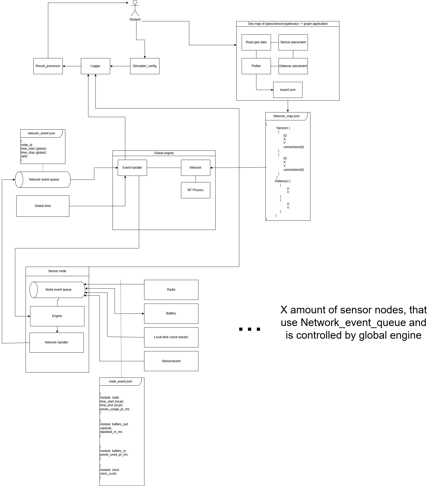

# ES8-Project Simulator Source Overview

## Main Entry Point

### main.py
This is the main entry script for the simulator.

## Core Types

### custom_types.py
Defines core data models using Pydantic. The main type is:
- **EventNet**: Represents a network event with fields for node ID, start/end times, data payload, and type.

## Simulator Engine

### simulator/engine.py
This file is a placeholder for the main simulation engine logic. It currently contains only a `main()` function stub.

## Event Queue

### simulator/event_net_queue.py
Implements the `event_net_queue` class, which manages a queue of `EventNet` objects. Key features:
- Add, remove, and retrieve events.
- Filter events by `time_start` and `time_end`.
- Optionally return events as JSON using Pydantic's model dumping.

## Node and Gateway

### node/node.py and gateway/gateway.py
These files are present but currently empty, indicating planned or in-progress modules for node and gateway logic in the simulator.

---

This structure provides a foundation for a modular simulator, with clear separation between event types, queue management, and (future) node/gateway logic.
# Simulator Documentation
